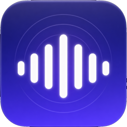

<p align="center">
  
</p>

<h1 align="center">Sidetone</h1>

<p align="center">Hear your own mic through your headphones, from the macOS menu bar.</p>

Sidetone sends any input to whatever output you pick. Usually that means hearing
your own microphone while you talk, but a line-in works just as well. It lives in
the menu bar and keeps out of the way.

It works with any pair of devices. A USB mic into Bluetooth headphones trips up
most tools like this, because the two run on slightly different clocks and the
audio slowly falls apart. Sidetone handles that pair, and it keeps working if you
leave it on all day.

"Sidetone" is what phone engineers call the bit of your own voice they feed back
into the earpiece. Without it, people shout.

## Install

You need macOS 15 or later.

```sh
make install
```

macOS asks for microphone access the first time you start monitoring, and asks
about notifications when Sidetone first launches. Notifications are only used to
tell you when monitoring stops on its own, so it is safe to refuse.

### If you downloaded the DMG

Sidetone isn't notarized, because notarizing costs $99 a year and this is a free
side project. So the first time you open it, macOS blocks it and says it can't
check the app for malware. The only buttons are "Move to Trash" and "Done", and
Trash is the highlighted one. Click Done.

Being blocked is what makes macOS offer an exception, so do that part first. Then
open System Settings, go to Privacy & Security, scroll down to Security, and click
"Open Anyway" next to the message about Sidetone. Confirm with Touch ID or your
password, then click "Open Anyway" again in the dialog that follows. If Security
says nothing about Sidetone, open the app again and come straight back.

You only do this once. Building from source with `make install` skips it, because
macOS only puts that block on files you downloaded.

## Using it

Click the waveform in the menu bar, pick an input and an output, then flip the
switch. Use headphones. Through speakers your mic hears itself and howls, and
Sidetone will say so before you try it.

- The slider sets gain in dB. It ramps as you drag, so it won't click.
- The meter shows your level, and the bars below it show the frequencies, so you
  can see whether anything is arriving.
- `⌥⌘M` starts and stops monitoring from any app. You can add a hold-to-mute key
  in Settings, under Shortcuts.
- Latency sits in the panel. Low is the tightest. Automatic picks for you, and
  loosens up on its own if your Mac can't keep up.
- Save a pair of devices and their gain as a preset, under Settings, Presets.
- Unplug something and monitoring stops and tells you what went missing. Plug it
  back in and it starts again.
- Any input works, not only microphones. See below.
- Sidetone checks for new versions and offers to install them. It asks first, and
  you can turn the checking off in Settings.

## Not just microphones

Anything the Mac sees as an input works, which makes Sidetone useful for getting
sound out of a device that has nowhere to send it.

The case it gets used for most: a games console feeding the monitor's
picture-in-picture input, with the console's audio going into a USB line-in on the
Mac. Monitors play sound from their main input only, so the console picture appears
in the corner of the screen with no audio at all. Point Sidetone at the line-in and
send it to the monitor's speakers, and the console can be heard while the Mac keeps
the main picture.

Two things help here. The gain slider goes to +30 dB, because a line-in can arrive
quieter than you would like. And Sidetone knows a line input can't hear the room,
so it won't warn you about feedback when you send it to speakers, which it would if
you were using a microphone.

## More

[How it works](https://github.com/MylesShannon/sidetone/blob/main/docs/architecture.md)
covers the audio path.
[Development](https://github.com/MylesShannon/sidetone/blob/main/docs/development.md)
covers building, testing, and releases.

## Credits and license

The icon came from an image model. The small glyphs in the app are Apple's SF
Symbols. Everything else is written from scratch.

MIT, see [LICENSE](https://github.com/MylesShannon/sidetone/blob/main/LICENSE) and
[NOTICE](https://github.com/MylesShannon/sidetone/blob/main/NOTICE). This is a
personal project and isn't connected to any employer.
